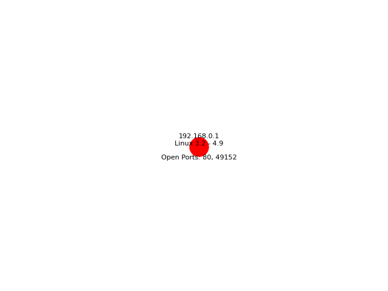

        
        NMAM
        Network Map And Monitor
        By Paul Oates 

Welcome to NMAM a tool for network mapping and badwidth monitoring. The following libaries are required:
```
        pip install argparse 
        pip install nmap 
        pip install networkx 
        pip install matplotlib 
        pip install scapy 
        pip install pyshark 
        pip install twilio 
```

The following programs are required 

https://nmap.org/
https://www.wireshark.org/download.html

Twilio keys can be genarated here. These are not incuded 

https://www.twilio.com/en-us

Usage 
python .\NMAM.py -s [Subnet Required] -m -b [bytes]
Note -m and -b are optional

Examples 
```
        python .\NMAM.py -s 192.168.1.0/24 -m -b 4096
        python .\NMAM.py -s 192.168.1.0/24  -b 4096
        python .\NMAM.py -s 192.168.1.0/24 -m
        python .\NMAM.py -h
```

help dialog 

usage: NMAM.py [-h] [-m] [-b BYTES] -s SUBNET

Network Monitoring Tool

optional arguments:
  -h, --help            show this help message and exit
  -m, --map             Map the network
  -b BYTES, --bytes BYTES
                        Monitor data usage. limit in bytes
  -s SUBNET, --subnet SUBNET
                        Subnet to scan. Required
